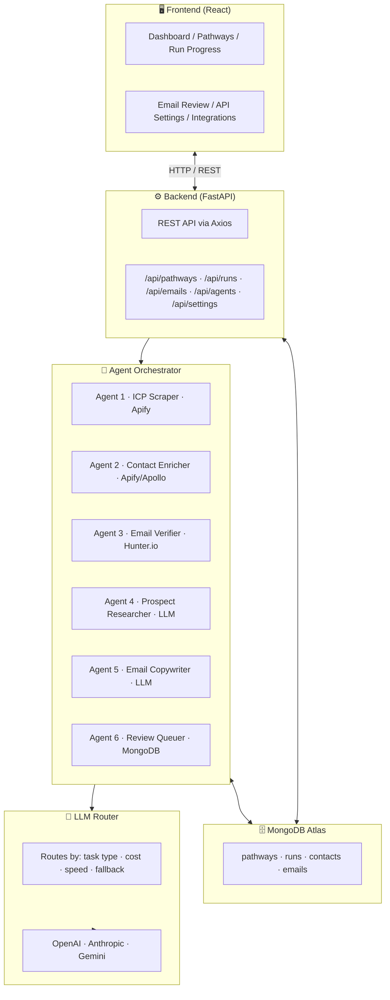
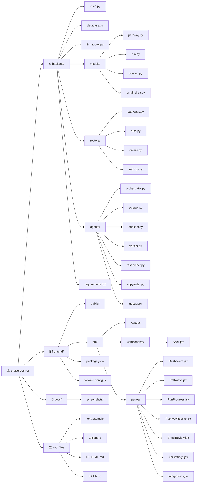

# 🚀 Cruise Control
 
 


> AI-powered outbound sales automation — from ICP definition to personalized email drafts, fully orchestrated.

---

## 📋 Project Summary 

Cruise Control is a personal, Agentic AI-powered internship-hunting web application. It lets you define up to five role-based "pathways" — for example, Business Analyst, Cloud, or AI/ML — each with its own resume and filters. Once a pathway is configured, a six-stage multi-agent pipeline runs automatically: it scrapes listed internships from job platforms, discovers unlisted startups that likely need interns but have no job postings, finds real contact emails of founders and decision-makers, parses your resume for skills and experience, drafts personalised cold outreach emails, and finally awaits your approval before sending. The goal is to fully automate the most tedious parts of internship hunting for a student with limited time and resources.

---

## 🧰 Tools & Tech

| Layer | Technology |
|---|---|
| **Frontend** | React 18, React Router v6, Axios, TailwindCSS |
| **Backend** | Python 3.11, FastAPI, Uvicorn, Motor (async MongoDB) |
| **Database** | MongoDB Atlas (cloud) / MongoDB local (dev fallback) |
| **AI / LLM** | OpenAI GPT-4o, Anthropic Claude 3.5, Google Gemini 1.5 |
| **LLM Routing** | Custom `llm_router.py` — model selection by task/cost/speed |
| **Web Scraping** | Apify (Apollo, LinkedIn actors) |
| **Email Verification** | Hunter.io API |
| **Email Sending** | Gmail OAuth2 (Phase 2) |
| **Auth** | MongoDB Atlas UI (no app-level auth in MVP) |
| **Deployment** | Local dev / Railway or Render (planned) |
| **Version Control** | Git + GitHub |

---

## 🏗️ Architecture



## 📁 Repository Structure



---

## ⚙️ Setup Instructions

### 1. Clone the repo

```bash
git clone https://github.com/YOUR_USERNAME/cruise-control.git
cd cruise-control
```

### 2. Backend Setup

```bash
cd backend
python -m venv venv

# Windows
venv\Scripts\activate

# Mac/Linux
source venv/bin/activate

pip install -r requirements.txt
```

Create your `.env` file (copy from `.env.example`):

```bash
cp .env.example .env
```

Start the backend:

```bash
uvicorn main:app --reload --port 8000
```

Backend health check: `http://localhost:8000/health`

### 3. Frontend Setup

```bash
cd frontend
npm install
npm start
```

Frontend runs at: `http://localhost:3000`

---

## 🔐 Environment Variables (`.env.example`)

```env
# MongoDB
MONGO_URL=mongodb+srv://<username>:<password>@cluster0.xxxxx.mongodb.net/cruise_control?retryWrites=true&w=majority

# LLM Providers
OPENAI_API_KEY=sk-...
ANTHROPIC_API_KEY=sk-ant-...
GEMINI_API_KEY=AIza...

# Scraping & Enrichment
APIFY_API_TOKEN=apify_api_...
HUNTER_API_KEY=...

# Gmail OAuth (Phase 2)
GMAIL_CLIENT_ID=
GMAIL_CLIENT_SECRET=
GMAIL_REFRESH_TOKEN=
```

> ⚠️ Never commit your real `.env` file. It is listed in `.gitignore`.

---

## 🔄 Agent Pipeline (Technical Details)

The orchestrator runs 6 agents sequentially per pathway run. Agent 1 uses Apify to scrape companies matching the ICP. Agent 2 enriches each company with contact data via Apollo. Agent 3 verifies email deliverability via Hunter.io. Agent 4 uses the LLM router to research each prospect (news, LinkedIn signals). Agent 5 generates a personalized email draft using researched context. Agent 6 saves all drafts to MongoDB for human review. The LLM router selects the optimal provider per task — Gemini for fast research, Claude for copy, GPT-4o as fallback — balancing cost, speed, and quality automatically.

---

## 🧪 Testing the MVP (Phase 1 — Mocked)

1. Start backend: `uvicorn main:app --reload`
2. Start frontend: `npm start`
3. Navigate to `Dashboard` → click **New Pathway**
4. Fill ICP form → Save
5. Click **Run Agents** on the pathway card
6. Watch `Run Progress` page for agent status updates
7. When complete, navigate to `Email Review` to approve/edit drafts

For Phase 1, agent outputs are mocked — no real API calls are made unless keys are configured.

---

## 🗺️ Roadmap

| Phase | Status | Description |
|---|---|---|
| Phase 1 | ✅ MVP | Mocked agent pipeline, full UI, MongoDB persistence |
| Phase 2 | 🔄 In Progress | Live Apify + Hunter + LLM integration |
| Phase 3 | 📋 Planned | Gmail OAuth send, analytics dashboard, multi-user auth |

---

## 🚀 Push to GitHub

```bash
# From project root
git init
git add .
git commit -m "feat: initial Cruise Control MVP"
git branch -M main
git remote add origin https://github.com/YOUR_USERNAME/cruise-control.git
git push -u origin main
```

---

## 📄 Licence

MIT — see `LICENCE` file.

